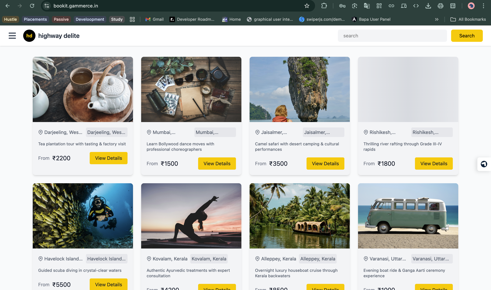
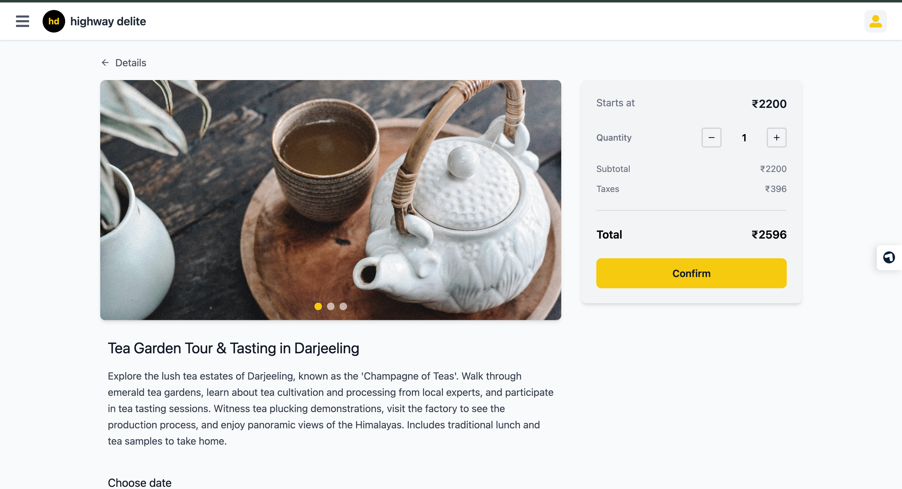
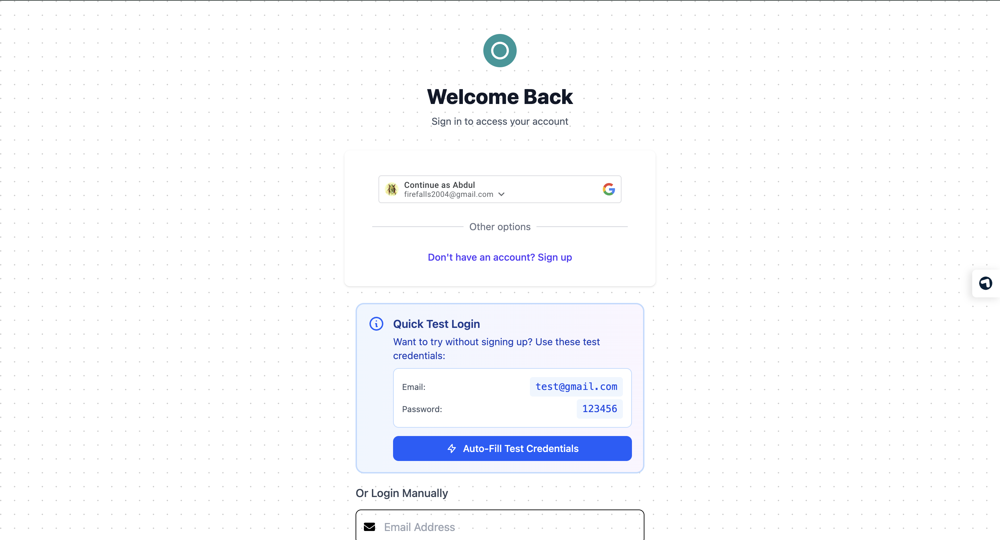

# BOOKIT - Experience Booking Platform

A full-stack web application for discovering and booking unique experiences. Built with React 19, Node.js, Express 5, and MongoDB.

---

## 🌐 Live Demo

**Deployed Link:** [bookit.gammerce.in](https://bookit.gammerce.in)

### Test Credentials
```
Email: test@gmail.com
Password: 123456
```

---

## 📸 Screenshots

### Homepage

*Browse and search experiences with responsive design*

### Experience Details

*Detailed view with image gallery, time slots, and booking summary*

### Authentication

*Secure login with email/password and Google OAuth 2.0*

---

## ✨ Features

### User Features
- Browse and search experiences
- User authentication (Email/Password & Google OAuth)
- Mobile OTP verification
- Apply promo codes for discounts

### Technical Features
- Fully responsive design (mobile-first)
- Lazy loading images with skeleton loaders
- JWT-based authentication
- 📦 AWS S3 integration for file storage
- 🎯 RESTful API architecture

---

## 🛠️ Tech Stack

| Category | Technology |
|----------|-----------|
| **Frontend** | React 19, Vite, Tailwind CSS |
| **Backend** | Node.js, Express 5 |
| **Database** | MongoDB, Mongoose |
| **Authentication** | JWT, Google OAuth 2.0, bcrypt |
| **File Storage** | AWS S3 |e

---

## 📋 Prerequisites

Before you begin, ensure you have the following installed:
- **Node.js** (v18 or higher)
- **npm** or **yarn**
- **MongoDB** (local or MongoDB Atlas account)
- **Git**

---

## 🚀 Installation & Setup

### 1. Clone the Repository

```bash
git clone https://github.com/Abdul-Rakib/Bookit.git
cd Bookit
```

### 2. Backend Setup

```bash
# Navigate to backend directory
cd backend

# Install dependencies
npm install

# Create .env file
touch .env
```

### 3. Configure Environment Variables

Create a `.env` file in the `backend` directory with the following variables:

```env
# Server Configuration
PORT=5000
NODE_ENV=development

# Database
MONGO_URI=mongodb://localhost:27017/bookit
# Or use MongoDB Atlas:
# MONGO_URI=mongodb+srv://<username>:<password>@cluster.mongodb.net/bookit

# JWT Secret (generate a strong random string)
JWT_SECRET=your_jwt_secret_key_here

# Google OAuth 2.0
GOOGLE_CLIENT_ID=your_google_client_id_here

# CORS Origins (comma-separated)
ALLOWED_ORIGINS=http://localhost:5173,http://localhost:3000

# SMS API (Optional - for OTP verification)
ONEAPI_SMS_API_KEY=your_sms_api_key_here

# AWS S3 Configuration (Optional - if using file uploads)
AWS_ACCESS_KEY_ID=your_aws_access_key
AWS_SECRET_ACCESS_KEY=your_aws_secret_key
AWS_REGION=ap-south-1
AWS_S3_BUCKET=your_bucket_name
```

### 4. Frontend Setup

```bash
# Navigate to frontend directory (from project root)
cd frontend

# Install dependencies
npm install
```

### 5. Configure Frontend API URL

The frontend is configured to use a proxy in `vite.config.js`. If you need to change the backend URL, update the proxy configuration:

```javascript
// frontend/vite.config.js
export default defineConfig({
  server: {
    proxy: {
      '/api': 'http://localhost:5000'  // Update if your backend runs on a different port
    }
  }
})
```

---

## 🎯 Running the Application

### Development Mode

#### Option 1: Run Backend and Frontend Separately

**Terminal 1 - Backend:**
```bash
cd backend
npm run dev
# Server will run on http://localhost:5000
```

**Terminal 2 - Frontend:**
```bash
cd frontend
npm run dev
# App will run on http://localhost:5173
```

#### Option 2: Run Backend in Production Mode
```bash
cd backend
npm start
```

### Production Build

```bash
# Build frontend
cd frontend
npm run build

# The built files will be in frontend/dist
# Backend will serve these static files in production mode

# Run backend in production
cd ../backend
NODE_ENV=production npm start
```

---

## 📁 Project Structure

```
BOOKIT/
├── backend/
│   ├── controllers/       # Request handlers
│   │   ├── auth.js
│   │   ├── booking.js
│   │   ├── experience.js
│   │   └── user.js
│   ├── data/             # Sample/seed data
│   │   └── sampleData.js
│   ├── middlewares/      # Custom middleware
│   │   └── auth.js
│   ├── models/           # Mongoose schemas
│   │   ├── booking.js
│   │   ├── experience.js
│   │   ├── otp.js
│   │   ├── promoCode.js
│   │   └── user.js
│   ├── routes/           # API routes
│   │   ├── auth.js
│   │   ├── booking.js
│   │   ├── experience.js
│   │   ├── promo.js
│   │   └── user.js
│   ├── utils/            # Utility functions
│   │   ├── s3Utils.js
│   │   └── smsUtils.js
│   ├── .env              # Environment variables
│   ├── package.json
│   └── server.js         # Entry point
│
├── frontend/
│   ├── public/           # Static assets
│   ├── src/
│   │   ├── assets/       # Images, fonts, etc.
│   │   ├── components/   # Reusable components
│   │   │   ├── navbar/
│   │   │   └── profile/
│   │   ├── context/      # React Context
│   │   │   └── globalContext.jsx
│   │   ├── hooks/        # Custom hooks
│   │   │   ├── useAuth.jsx
│   │   │   └── useLogin.jsx
│   │   ├── pages/        # Page components
│   │   │   ├── Auth/
│   │   │   ├── dashboard/
│   │   │   ├── experiences/
│   │   │   └── footer/
│   │   ├── routes/       # Route protection
│   │   │   └── ProtectedRoutes.jsx
│   │   ├── services/     # API services
│   │   │   └── api.js
│   │   ├── utils/        # Utility functions
│   │   ├── App.jsx       # Main app component
│   │   ├── main.jsx      # Entry point
│   │   └── index.css     # Global styles
│   ├── package.json
│   └── vite.config.js
│
├── screenshots/          # Application screenshots
└── README.md
```

---

## 🔑 Key API Endpoints

- `POST /api/auth/google` - Google OAuth login
- `POST /api/auth/send-otp` - Send OTP for phone verification
- `POST /api/auth/verify-otp` - Verify OTP
- `POST /api/auth/logout` - User logout
- `GET /experiences` - Get all experiences (with search/filter)
- `GET /experiences/:id` - Get single experience details
- `POST /bookings` - Create a new booking
- `GET /bookings/user/:userId` - Get user's bookings
- `POST /promo/validate` - Validate promo code

---

## 🧪 Testing

### Test the Application
1. Start both backend and frontend servers
2. Open browser to `http://localhost:5173`
3. Use test credentials or sign up with Google
4. Browse experiences and make a test booking

---

## License

ISC

---

## Author

**Abdul Rakib**